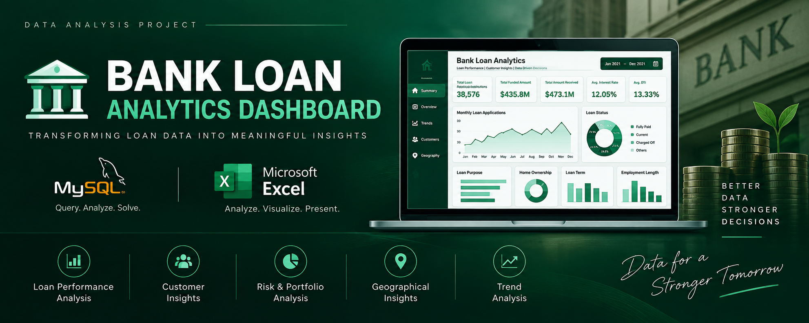

# <h1 align="center">Bank Loan Analytics Dashboard | SQL & Excel</h1>

<p align="center">
  
</p>

<p align="center">
  
  
  
  
  
</p>

<p align="center">
An end-to-end financial analytics project built using <strong>MySQL</strong> and <strong>Microsoft Excel</strong> to analyse lending performance, loan quality, repayment trends, and borrower behaviour through an interactive dashboard.
</p>

---

## Dashboard Preview

### Summary Dashboard

<p align="center">

</p>

### Overview Dashboard

<p align="center">

</p>

---

# Project Overview

The **Bank Loan Analytics Dashboard** is an end-to-end data analytics project developed using **MySQL** and **Microsoft Excel**. The project analyses a bank's loan portfolio by tracking loan applications, funded amounts, repayments, loan quality, and borrower characteristics.

The dashboard transforms raw loan data into interactive reports that help monitor lending performance and support business decision-making.

---

# Business Problem

Banks process thousands of loan applications across different customer segments. Without an interactive reporting system, it becomes difficult to monitor portfolio performance, identify high-risk loans, evaluate repayment trends, and analyse borrower behaviour.

This dashboard provides a centralised reporting solution to monitor key lending KPIs and generate actionable business insights.

---

# Project Objectives

- Monitor loan portfolio performance.
- Analyse Month-to-Date (MTD) and Month-over-Month (MoM) trends.
- Measure loan disbursement and repayment performance.
- Evaluate Good Loans and Bad Loans.
- Analyse lending patterns across multiple business dimensions.
- Build an interactive dashboard for business users.

---

# Dataset Information

| Feature | Details |
|----------|----------|
| Domain | Banking / Financial Services |
| Records | 38,576 Loan Applications |
| Columns | 24 |
| Analysis Tool | MySQL |
| Dashboard Tool | Microsoft Excel |

### Dataset Includes

- Loan Amount
- Loan Status
- Interest Rate
- Debt-to-Income Ratio (DTI)
- Loan Purpose
- Employment Length
- Home Ownership
- Annual Income
- State
- Loan Grade
- Verification Status
- Loan Term

---

# Tech Stack

- MySQL
- Microsoft Excel
- Pivot Tables
- Pivot Charts
- Slicers
- Conditional Formatting

---

# Project Workflow

```text
Raw Loan Dataset
        │
        ▼
Data Cleaning
        │
        ▼
SQL Data Analysis
        │
        ▼
Business KPI Calculation
        │
        ▼
Excel Pivot Tables
        │
        ▼
Interactive Dashboard
        │
        ▼
Business Insights
```

---

# Dashboard Pages

## 1. Summary Dashboard

### Key KPIs

- Total Loan Applications
- Total Funded Amount
- Total Amount Received
- Average Interest Rate
- Average Debt-to-Income Ratio (DTI)
- Month-to-Date (MTD)
- Month-over-Month (MoM)

### Loan Quality Analysis

- Good Loan Percentage
- Good Loan Applications
- Good Loan Funded Amount
- Good Loan Amount Received
- Bad Loan Percentage
- Bad Loan Applications
- Bad Loan Funded Amount
- Bad Loan Amount Received

### Loan Status Summary

- Total Applications
- Funded Amount
- Amount Received
- Average Interest Rate
- Average DTI

---

## 2. Overview Dashboard

### Visualisations

- Monthly Loan Trends
- Regional Analysis by State
- Loan Term Distribution
- Employment Length Analysis
- Loan Purpose Analysis
- Home Ownership Analysis

---

# Key Performance Indicators

| KPI | Description |
|------|-------------|
| Total Loan Applications | Total loan applications received |
| Total Funded Amount | Total amount disbursed as loans |
| Total Amount Received | Total repayment received from borrowers |
| Average Interest Rate | Average interest rate across all loans |
| Average DTI | Average Debt-to-Income Ratio |
| Good Loan % | Percentage of Fully Paid & Current loans |
| Bad Loan % | Percentage of Charged Off loans |

---

# SQL Analysis

I used the SQL layer to calculate and validate all business KPIs before developing the dashboard.

### SQL Skills Demonstrated

- Aggregate Functions
- COUNT()
- SUM()
- AVG()
- CASE Statements
- GROUP BY
- ORDER BY
- WHERE Clause
- Conditional Aggregation
- MONTH()
- MONTHNAME()
- Date Functions
- KPI Calculations
- MTD & MoM Analysis

---

# Excel Features Used

- Pivot Tables
- Pivot Charts
- Slicers
- Conditional Formatting
- Interactive Dashboard
- KPI Cards
- Dynamic Filtering
- Custom Dashboard Design

---

# Repository Structure

```text
Bank-Loan-Analytics-Dashboard
│
├── Dashboard
│   └── Bank Loan Excel Data Analysis.xlsx
│
├── Dataset
│   └── financial_loan.csv
│
├── Images
│   ├── Banner.png
│   ├── Summary Dashboard.png
│   └── Overview Dashboard.png
│
├── SQL
│   └── Bank Loan SQL Data Analysis.sql
│
└── README.md
```

---

# How to Use

1. Clone or download the repository.
2. Import the dataset into MySQL.
3. Execute the SQL script.
4. Open the Excel dashboard.
5. Refresh Pivot Tables if required.
6. Explore the dashboard using interactive slicers.

---

# Author


**Ashish Gautam**

**Data Analyst | SQL | Excel | Power BI**

**Email:** ashishgautam323@gmail.com

**LinkedIn:** https://www.linkedin.com/in/theashishgautam
